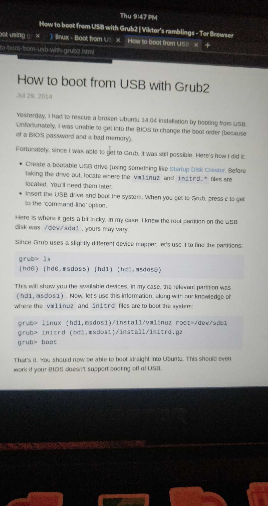
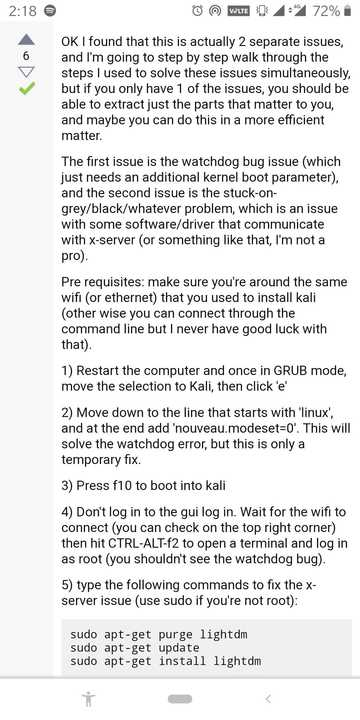

## Kali installation and setup

## Booting directly from grub
* Loads kernel
* Then filesystem
* Best way to bypass BIOS when trying to boot from a USB



### Grey screen issue after login





### Slow apt downloads

* Problem with the DNS hence change /etc/resolv.conf
* Add new nameservers
* Refer [this](https://www.blackmoreops.com/2013/10/30/fix-kali-linux-apt-get-slow-update/)
* Refer for `/etc/apt/sources.list` [this](https://www.metahackers.pro/speed-kali-linux-update/)
* Update `/etc/sysctl.conf` to disable ipv6

```
net.ipv6.conf.all.disable_ipv6 = 1
net.ipv6.conf.default.disable_ipv6 = 1
net.ipv6.conf.lo.disable_ipv6 = 1
```


### Docker installation

https://medium.com/@airman604/installing-docker-in-kali-linux-2017-1-fbaa4d1447fe

### Installing graphic (nvidia) drivers

* Official docs
https://docs.kali.org/general-use/install-nvidia-drivers-on-kali-linux

* Unofficial docs
https://hackersterminal.com/how-to-install-nvidia-driver-on-kali-linux/

### In case a black screen is encountered while nvidia driver installation


### Synaptic drivers (for tap to click)

[See this](https://unix.stackexchange.com/questions/337008/activate-tap-to-click-on-touchpad)
